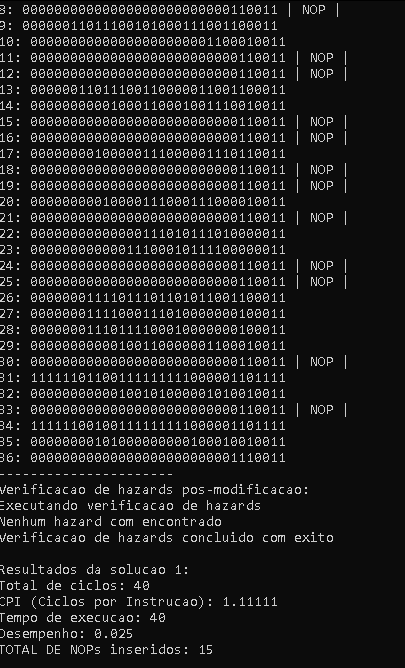

# Trabalhos Organização de Computadores

Este repositório contém os trabalhos desenvolvidos durante a matéria de organização de computadores, que envolveram:\
M1 - Separação e reconhecimento de instruções RISC-V\
M2 - Detecção de hazards, NOPs e desempenho\
M3 - Calculo de desempenho com leitura IJ X JI
